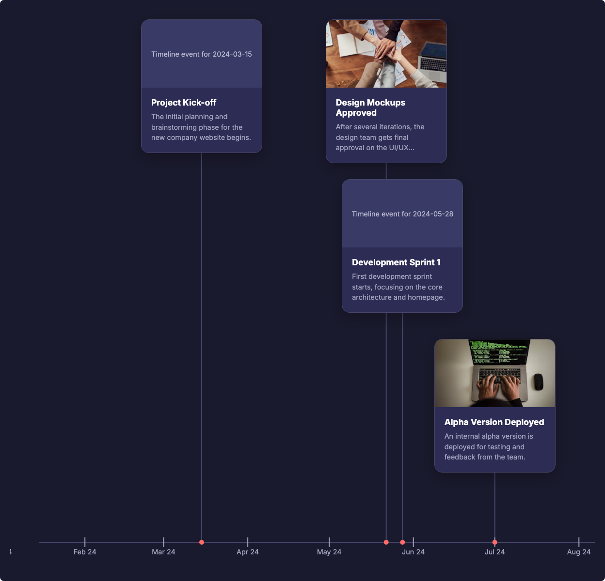
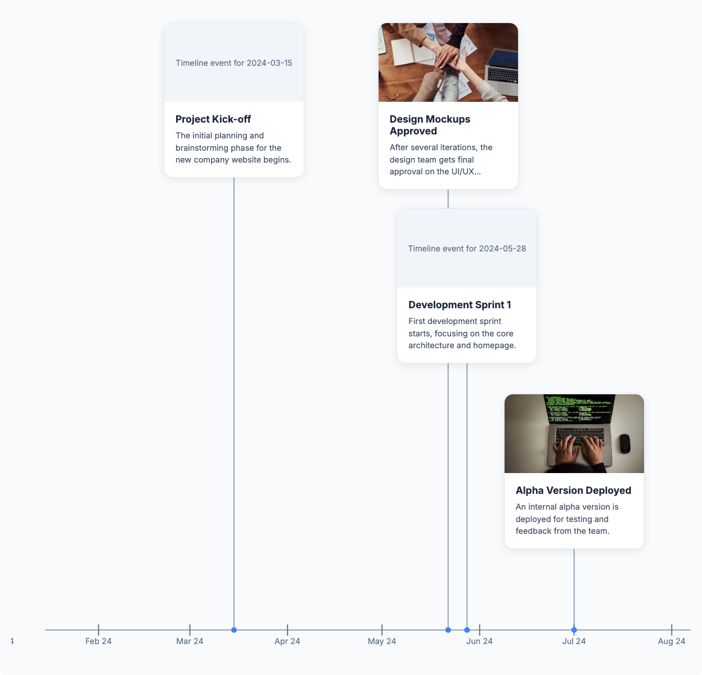
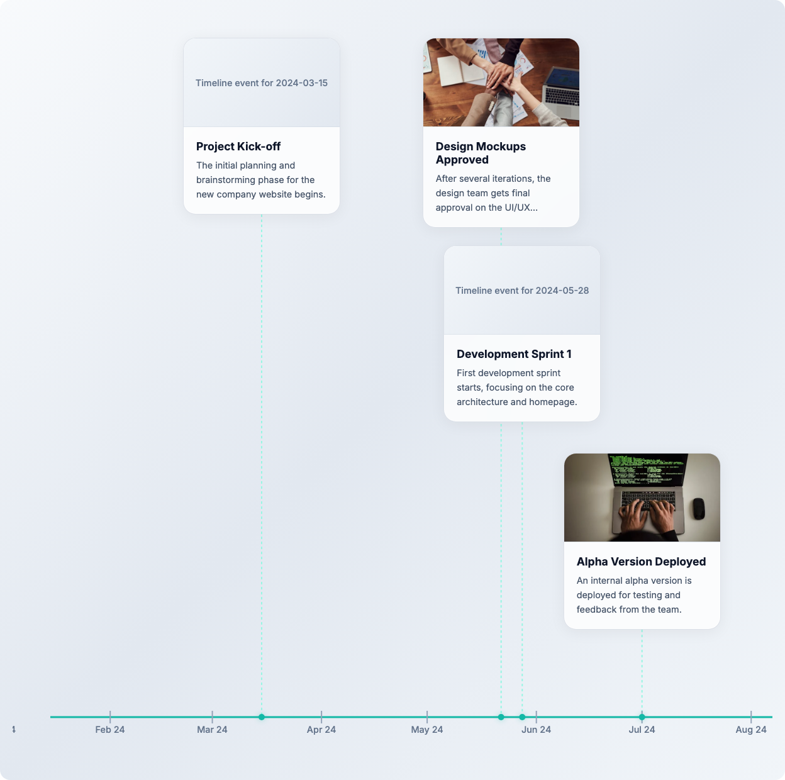

# lit-timeline

A customizable timeline component built with [Lit](https://lit.dev/) for displaying chronological events in horizontal or vertical layouts.

## Features

- **Multiple layouts** - Horizontal, vertical, and list view modes
- **Auto date range detection** - Automatically determines timeline bounds from events
- **Pre-built themes** - Dark, light, and modern themes included
- **CSS Parts theming** - Fully customizable appearance through CSS `::part()` selectors
- **Responsive design** - Scrollable container adapts to different screen sizes, with a one-sided mobile vertical layout
- **Accessible** - ARIA labels, keyboard navigation, and screen reader support
- **Lightweight** - Built on Lit with minimal dependencies

## Screenshots

### Dark Theme



### Light Theme



### Modern Theme



## Installation

```bash
npm install lit-timeline
```

**Peer dependency**: This package requires `lit` ^3.0.0 as a peer dependency.

```bash
npm install lit
```

## Quick Start

```html
<script type="module">
  import 'lit-timeline';
</script>

<timeline-component label="Project milestones">
  <timeline-event date="2024-03-15">
    <h3>Project Kick-off</h3>
    <p>Initial planning phase begins.</p>
  </timeline-event>

  <timeline-event date="2024-06-01" image-src="launch.jpg" image-alt="Product launch">
    <h3>Product Launch</h3>
    <p>Official release to the public.</p>
  </timeline-event>
</timeline-component>
```

## Components

### `<timeline-component>`

The main container that positions events on a timeline axis.

#### Attributes

| Attribute    | Type    | Default    | Description                                         |
| ------------ | ------- | ---------- | --------------------------------------------------- |
| `vertical`   | boolean | `false`    | Display timeline vertically instead of horizontally |
| `list`       | boolean | `false`    | Display as a simple list without timeline axis      |
| `start-year` | number  | auto       | Override start year for timeline range              |
| `end-year`   | number  | auto       | Override end year for timeline range                |
| `label`      | string  | `Timeline` | Accessible label for the timeline region            |

#### Examples

**Horizontal timeline (default):**

```html
<timeline-component label="Company history">
  <timeline-event date="2020-01-15">...</timeline-event>
  <timeline-event date="2022-06-30">...</timeline-event>
</timeline-component>
```

**Vertical timeline:**

```html
<timeline-component vertical label="Project phases">
  <timeline-event date="2024-01-01">...</timeline-event>
  <timeline-event date="2024-03-15">...</timeline-event>
</timeline-component>
```

**List view (no timeline axis):**

```html
<timeline-component list label="Event list">
  <timeline-event date="2024-01-01">...</timeline-event>
  <timeline-event date="2024-06-15">...</timeline-event>
</timeline-component>
```

**Fixed year range:**

```html
<timeline-component start-year="1990" end-year="2020" label="Career timeline">
  <timeline-event date="1995-06-15">...</timeline-event>
  <timeline-event date="2010-09-01">...</timeline-event>
</timeline-component>
```

### `<timeline-event>`

Individual event cards displayed on the timeline.

#### Attributes

| Attribute   | Type   | Default  | Description                                                  |
| ----------- | ------ | -------- | ------------------------------------------------------------ |
| `date`      | string | required | Canonical calendar date in strict `YYYY-MM-DD` format        |
| `image-src` | string | `""`     | URL for the event header image                               |
| `image-alt` | string | `""`     | Alternative text for a meaningful image; empty is decorative |

#### Slots

| Slot    | Description                                                  |
| ------- | ------------------------------------------------------------ |
| default | Event content (typically `<h3>` title and `<p>` description) |

#### Examples

**With image:**

```html
<timeline-event
  date="2024-03-15"
  image-src="photo.jpg"
  image-alt="Speaker presenting at the conference"
>
  <h3>Conference Talk</h3>
  <p>Presented at the annual tech conference.</p>
</timeline-event>
```

**Without image:**

```html
<timeline-event date="2024-03-15">
  <h3>Team Meeting</h3>
  <p>Quarterly planning session with the team.</p>
</timeline-event>
```

A standalone `<timeline-event>` is visible, relatively positioned, and keyboard focusable. When it is a direct child of `<timeline-component>`, the parent takes over its positioning and roving tabindex. Images are decorative by default; set `image-alt` only when the image conveys content not already present in the event text. Placeholder artwork is always decorative.

## Styling

By default, these components have **minimal styling** - only structural/layout CSS is applied. All visual theming (colors, borders, shadows) must be applied via CSS parts or pre-built themes.

### Pre-built Themes

Three ready-to-use themes are included:

| Theme  | File               | Description                               |
| ------ | ------------------ | ----------------------------------------- |
| Dark   | `theme-dark.css`   | Dark purple background with coral accents |
| Light  | `theme-light.css`  | Clean light theme with blue accents       |
| Modern | `theme-modern.css` | Glass-morphism effects with teal accents  |

**Using a theme:**

```html
<!-- Import the theme CSS -->
<link rel="stylesheet" href="node_modules/lit-timeline/src/styles/theme-dark.css" />

<!-- Or with a bundler -->
<style>
  @import 'lit-timeline/styles/theme-dark.css';
</style>

<!-- Wrap your timeline in the theme class -->
<div class="timeline-dark-theme">
  <timeline-component label="My timeline">
    <timeline-event date="2024-01-01">
      <h3>Event Title</h3>
      <p>Event description</p>
    </timeline-event>
  </timeline-component>
</div>
```

Each theme uses a wrapper class:

- `.timeline-dark-theme` - Dark theme
- `.timeline-light-theme` - Light theme
- `.timeline-modern-theme` - Modern theme

### Custom Themes

Use CSS `::part()` selectors to create custom themes:

```css
/* Apply a dark theme */
timeline-component::part(axis-line) {
  stroke: #47476b;
  stroke-width: 2;
}
timeline-component::part(connector-line) {
  stroke: #47476b;
}
timeline-component::part(dot) {
  fill: #ff6b6b;
}
timeline-component::part(marker-tick) {
  stroke: #a4a4c1;
}
timeline-component::part(marker-text) {
  fill: #a4a4c1;
}

timeline-event::part(card) {
  background-color: #2c2c54;
  border: 1px solid #47476b;
  border-radius: 16px;
  box-shadow: 0 10px 30px rgba(0, 0, 0, 0.3);
}
timeline-event::part(image),
timeline-event::part(image-placeholder) {
  background-color: #3a3a66;
}

/* Slotted content styling */
timeline-event h3 {
  color: #ffffff;
}
timeline-event p {
  color: #a4a4c1;
}
```

### CSS Custom Properties

`<timeline-component>` supports these properties:

| Property                      | Default  | Purpose                     |
| ----------------------------- | -------- | --------------------------- |
| `--timeline-axis-color`       | unset    | Axis color                  |
| `--timeline-axis-width`       | `2`      | Axis stroke width           |
| `--timeline-connector-color`  | unset    | Connector color             |
| `--timeline-connector-width`  | `2`      | Connector stroke width      |
| `--timeline-dot-color`        | unset    | Event dot color             |
| `--timeline-dot-size`         | `5`      | Event dot radius            |
| `--timeline-marker-color`     | unset    | Marker tick color           |
| `--timeline-marker-font-size` | `0.9rem` | Marker label font size      |
| `--timeline-h-row-gap`        | `330px`  | Horizontal-mode row gap     |
| `--timeline-v-column-gap`     | `100px`  | Vertical-mode column gap    |
| `--timeline-list-gap`         | `16px`   | List-mode event gap         |
| `--timeline-list-padding`     | `20px`   | List-mode container padding |

`<timeline-event>` supports these properties:

| Property                               | Default                          | Purpose                      |
| -------------------------------------- | -------------------------------- | ---------------------------- |
| `--timeline-event-width`               | `250px`                          | Card width                   |
| `--timeline-event-bg-color`            | `#2c2c54`                        | Card background              |
| `--timeline-event-border-color`        | `#47476b`                        | Card border color            |
| `--timeline-event-border-radius`       | `16px`                           | Card corner radius           |
| `--timeline-event-shadow`              | `0 10px 30px rgba(0, 0, 0, 0.3)` | Card box shadow              |
| `--timeline-event-image-height`        | `140px`                          | Image area height            |
| `--timeline-event-content-padding`     | `20px`                           | Content padding              |
| `--timeline-event-content-min-height`  | `125px`                          | Content minimum height       |
| `--timeline-event-heading-color`       | `#ffffff`                        | Slotted heading color        |
| `--timeline-event-heading-font-size`   | `1.1rem`                         | Slotted heading font size    |
| `--timeline-event-heading-font-weight` | `700`                            | Slotted heading font weight  |
| `--timeline-event-text-color`          | `#a4a4c1`                        | Slotted paragraph color      |
| `--timeline-event-text-font-size`      | `0.9rem`                         | Slotted paragraph font size  |
| `--timeline-event-placeholder-bg`      | `#3a3a66`                        | Placeholder background       |
| `--timeline-event-placeholder-color`   | `#8c8caf`                        | Placeholder text color       |
| `--timeline-event-focus-offset`        | `4px`                            | Focus outline offset         |
| `--timeline-event-date-font-size`      | `0.85rem`                        | List date font size          |
| `--timeline-event-date-font-weight`    | `500`                            | List date font weight        |
| `--timeline-event-date-color`          | `currentColor`                   | List date color              |
| `--timeline-list-event-max-width`      | `600px`                          | List-mode card maximum width |

### CSS Parts

For styling, use CSS `::part()` selectors:

**Timeline Component Parts:**

```css
timeline-component::part(scroll-wrapper) {
  /* Scrollable container */
}
timeline-component::part(container) {
  /* Main container */
}
timeline-component::part(svg-layer) {
  /* SVG overlay */
}
timeline-component::part(axis-line) {
  /* Timeline axis */
}
timeline-component::part(connector-line) {
  /* Event connectors */
}
timeline-component::part(marker-tick) {
  /* Date marker ticks */
}
timeline-component::part(marker-text) {
  /* Date marker labels */
}
timeline-component::part(dot) {
  /* Event dots */
}
```

**Timeline Event Parts:**

```css
timeline-event::part(card) {
  /* Card container */
}
timeline-event::part(image) {
  /* Event image */
}
timeline-event::part(image-placeholder) {
  /* Placeholder when no image */
}
timeline-event::part(content) {
  /* Content area */
}
timeline-event::part(date) {
  /* Date display (shown in list view) */
}
```

### Theming Example

```css
/* Grayscale images that colorize on hover */
.grayscale-hover timeline-event::part(image) {
  filter: grayscale(100%);
  transition: filter 0.3s ease;
}

.grayscale-hover timeline-event:hover::part(image) {
  filter: grayscale(0%);
}
```

## Date and Ordering Behavior

Event dates must be real calendar dates in canonical `YYYY-MM-DD` form. For example, `2024-02-29` is accepted, while `2023-02-29`, `2024-2-09`, missing dates, and normalized overflow dates such as `2024-02-30` are invalid. Formatting uses UTC, so the displayed calendar day does not change with the viewer's time zone.

Invalid or missing-date events are hidden, excluded from the date range and layout, and produce a deterministic console warning instead of breaking valid siblings. Direct valid `<timeline-event>` children are reordered chronologically in the light DOM, keeping visual, keyboard, and assistive-technology order aligned.

The timeline automatically determines its date range:

- **Short timelines** (< 2 years): Shows monthly markers (e.g., "Mar 24", "Apr 24")
- **Long timelines** (≥ 2 years): Shows 5-year markers (e.g., "1990", "1995", "2000")

Override this with `start-year` and `end-year` attributes for explicit control. Vertical timelines narrower than 600px use a one-sided layout with the axis on the left and every card on the right, without horizontal scrolling. At 600px and wider, vertical layouts alternate cards on both sides.

## Accessibility

The timeline component is designed with accessibility in mind, following WCAG 2.1 AA guidelines.

### ARIA Support

- Timeline region has `role="region"` with configurable `aria-label`
- Event cards have `role="article"` with descriptive labels
- Screen reader-only date announcements for each event
- SVG decorations are hidden from assistive technology (`aria-hidden="true"`)

### Keyboard Navigation

The timeline uses the **roving tabindex** pattern for efficient keyboard navigation:

| Key           | Action                                     |
| ------------- | ------------------------------------------ |
| `Tab`         | Move focus into/out of the timeline        |
| `Arrow Right` | Move to next event (horizontal layout)     |
| `Arrow Left`  | Move to previous event (horizontal layout) |
| `Arrow Down`  | Move to next event (vertical layout)       |
| `Arrow Up`    | Move to previous event (vertical layout)   |
| `Home`        | Move to first event                        |
| `End`         | Move to last event                         |

**How it works:**

1. Press `Tab` to focus the timeline, then `Tab` again to focus the first event
2. Use arrow keys to navigate between events (direction depends on layout orientation)
3. Press `Tab` to exit the timeline and continue to the next focusable element

```html
<!-- Horizontal: use Left/Right arrows -->
<timeline-component label="History">
  <timeline-event date="2024-01-01">...</timeline-event>
  <timeline-event date="2024-06-01">...</timeline-event>
</timeline-component>

<!-- Vertical: use Up/Down arrows -->
<timeline-component vertical label="Process">
  <timeline-event date="2024-01-01">...</timeline-event>
  <timeline-event date="2024-06-01">...</timeline-event>
</timeline-component>
```

### Focus Management

- Only one event is in the tab order at a time (roving tabindex)
- Focus automatically scrolls events into view
- Visible focus indicator with customizable offset (`--timeline-event-focus-offset`)

## Browser Support

Supports all modern browsers:

- Chrome/Edge 88+
- Firefox 78+
- Safari 14+

## TypeScript

Full TypeScript support with exported types:

```typescript
import { TimelineComponent, TimelineEvent } from 'lit-timeline';
import type { TimelineEventData, EventLayout, SVGData } from 'lit-timeline';

// Type-safe element selection
const timeline = document.querySelector('timeline-component')!;
timeline.vertical = true;

const event = document.querySelector('timeline-event')!;
console.log(event.date); // string
```

## Development

```bash
npm test           # Build current source, then run cross-browser unit tests
npm run test:unit  # Run unit tests against output that is already built
npm run test:watch # Build once, then run unit tests in watch mode
npm run test:package
```

## License

[MIT](LICENSE)
